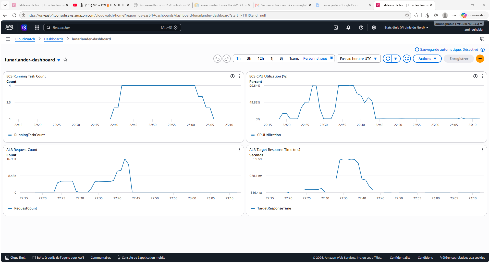

# Auto-Scalable Web Infrastructure on AWS

Provisioned a production-grade auto-scaling cloud infrastructure on AWS using Terraform (IaC), deploying a containerized FastAPI inference API on ECS Fargate behind an Application Load Balancer. Validated automatic scaling under load using Locust — tasks scaled from 1 to 4 containers as CPU exceeded 50%, then back to 1 after traffic subsided.

## Architecture

```
Internet
    │
    ▼
Application Load Balancer (ALB)
    │  ← distributes traffic, health checks /health
    ▼
ECS Fargate Service
    ├── Task 1 (lunarlander-api)
    ├── Task 2 (auto-scaled)
    ├── Task 3 (auto-scaled)
    └── Task 4 (auto-scaled)
         │
         ▼
   PPO Model (LunarLander)
         │
         ▼
    /predict → action {0,1,2,3}
```

**Auto-scaling trigger:** CloudWatch monitors `ECSServiceAverageCPUUtilization`. If CPU > 50% → scale out (up to 4 tasks). If CPU < 50% → scale in (minimum 1 task).

## Stack

| Layer | Technology |
|-------|-----------|
| IaC | Terraform |
| Container registry | Amazon ECR |
| Container orchestration | Amazon ECS Fargate |
| Load balancer | Application Load Balancer (ALB) |
| Auto-scaling | AWS Application Auto Scaling (CPU-based) |
| Observability | Amazon CloudWatch Dashboard |
| Inference API | FastAPI + Stable Baselines3 (PPO) |
| Load testing | Locust |

## Infrastructure (Terraform)

```
terraform/
├── main.tf          # AWS provider
├── variables.tf     # region, project name, CPU/memory, image URI
├── vpc.tf           # VPC, 2 public subnets (2 AZs), Internet Gateway
├── ecr.tf           # ECR repository + lifecycle policy
├── alb.tf           # ALB, target group, /health check, HTTP listener
├── ecs.tf           # ECS cluster, task definition, Fargate service
├── autoscaling.tf   # Target tracking policy (CPU 50%, 1-4 tasks)
├── cloudwatch.tf    # Dashboard: task count, CPU, request count, latency
└── outputs.tf       # ALB DNS, ECR URL, cluster name
```

## Load Test Results

Simulated 200 concurrent users with Locust (`/predict` endpoint — PPO model inference):

| Metric | Value |
|--------|-------|
| Total requests | ~88 000 |
| Error rate | 0.03% |
| Peak CPU | 99.64% |
| Peak task count | 4 |
| Avg response time (at peak) | ~1 800 ms |
| Avg response time (post-scale) | ~200 ms |

CloudWatch dashboard showing the full scale-up/down cycle:



## Deploy

**Prerequisites:** AWS CLI configured, Terraform installed, Docker running.

```bash
# 1. Build and push image to ECR
cd app
aws ecr get-login-password --region us-east-1 | docker login --username AWS --password-stdin <account_id>.dkr.ecr.us-east-1.amazonaws.com
docker build -t lunarlander .
docker tag lunarlander:latest <ecr_uri>:latest
docker push <ecr_uri>:latest

# 2. Deploy infrastructure
cd ../terraform
cp example.tfvars terraform.tfvars  # fill in ecr_image_uri
terraform init
terraform apply

# 3. Run load test
cd ../load-test
locust -f locustfile.py --host http://<alb_dns> --headless -u 200 -r 10 --run-time 10m

# 4. Destroy infrastructure
cd ../terraform
terraform destroy
```
